Within-Host Scaling
================

After deriving our equations for reservoir-host optimal virus growth
rate ( $r^ *$ ) and the equations for the spillover host virulence (
$\alpha_S$ ), we next sought to use publicly-available allometric data
to establish predictions of spillover host virulence for viruses derived
from reservoir hosts of diverse mammalian orders.

Since allometric scaling relationships with body mass are well-described
in the literature ([Brown et
al. 2004](https://esajournals.onlinelibrary.wiley.com/doi/full/10.1890/03-9000),
[DeLeo and Dobson 1996](https://www.nature.com/articles/379720a0)), we
opted to scale three key within-host parameters to host body-mass and
establish summary estimates by mammalian order. We chose the parameters
of host natural mortality rate ( $\mu$ ), tolerance of immunopathology (
$T_w$ ), and the magnitude of the constitutive immune response ( $g_0$ )
as parameters best-supported by publicly-available data. We additionally
modeled tolerance of direct virus pathology for a human spillover host (
$T_{vS}$ ), corresponding to phylogenetic distance between the reservoir
host in question and humans. Because we opted to make predictions by
mammalian order, we derived all parameter estimates using [generalized
additive models
(GAMs)](https://researchportal.bath.ac.uk/en/publications/mgcv-mixed-gam-computation-vehicle-with-gcvaicreml-smoothness-est)
fit to publicly-available life history data, incorporating a random
effect of host order.

## Estimating host natural mortality rates

Allometric relationships between host body mass and longevity are
well-established in the literature, particularly for mammals ([Brown et
al. 2004](https://esajournals.onlinelibrary.wiley.com/doi/full/10.1890/03-9000)).
As a result, we estimated order-specific natural mortality rates ( $\mu$
) from the effect of order on the regression of log10 of host body mass
against log10 maximum lifespan in years.

First, set your home directory to this subfolder within your main
“spillover-virulence” directory, and load appropriate packages:

    rm(list=ls())

    library(ggplot2)
    library(reshape2)
    library(plyr)
    library(dplyr)
    library(RColorBrewer)

    homewd =  "/Users/carabrook/Developer/spillover-virulence/"
    subwd = "figure-3"
    setwd(paste0(homewd, subwd))

Next, then load publicly-available data from [Jones et
al. 2009](https://doi.org/10.1890/08-1494.1) (“Pantheria”), combine with
additional data from [Healy et.
al. 2014](https://doi.org/10.1098/rspb.2014.0298), select the columns
relevant to your analysis, and clean and rename as needed:

    # Load data
    pan.dat <- read.csv(file="PanTHERIA.csv", header = T, stringsAsFactors = F)
    head(pan.dat)

    # And select only those columns of interest 
    pan.dat <- dplyr::select(pan.dat, 1:5, X5.1_AdultBodyMass_g, X17.1_MaxLongevity_m, X10.1_PopulationGrpSize, X21.1_PopulationDensity_n.km2, X22.1_HomeRange_km2, X18.1_BasalMetRate_mLO2hr)#, X5.2_BasalMetRateMass_g)
    head(pan.dat)

    # Rename
    names(pan.dat) <- c("order", "family", "genus", "species", "binomial", "mass_g", "max_lifespan_months", "pop_group_size", "pop_density_N_km2", "homerange_km2", "BMR_mLO2hr")#, "BMR_mg")
    pan.dat$max_lifespan_yrs <- pan.dat$max_lifespan_months/12

    # Add dash for binomial nomemclature
    pan.dat$binomial <- sub(" ", "_", pan.dat$binomial)

    # Correct errors
    pan.dat$max_lifespan_yrs[pan.dat$binomial=="Galeopterus_variegates"] <- 17.5 #from animaldiversity.org

    # Remove humans from dataset
    pan.dat = subset(pan.dat, binomial!="Homo_sapiens")

    # Rename some incorrect orders with contemporary taxonomy
    pan.dat$order[pan.dat$order=="Artiodactyla"] <- "Cetartiodactyla"
    pan.dat$order[pan.dat$order=="Cetacea"] <- "Cetartiodactyla"
    pan.dat$order[pan.dat$order=="Soricomorpha"] <- "Eulipotyphla"
    pan.dat$order[pan.dat$order=="Erinaceomorpha"] <- "Eulipotyphla"

    # Convert BMR to W/G
    pan.dat$BMR_mLO2hr <- (pan.dat$BMR_mLO2hr/60/60*20.1)/pan.dat$mass_g
    names(pan.dat)[names(pan.dat)=="BMR_mLO2hr"] <- "BMR_W_g"

    # Correct errors
    pan.dat$BMR_W_g[pan.dat$binomial=="Acrobates_pygmaeus"] <- 0.084/pan.dat$mass_g[pan.dat$binomial=="Acrobates_pygmaeus"]  # from AnAge database

    #add healy data
    healy.dat <- read.csv(file = "Healy.csv", header = T, stringsAsFactors = F)
    head(healy.dat)
    healy.dat = subset(healy.dat, class=="Mammalia")
    healy.dat <- dplyr::select(healy.dat, species, maximum_lifespan_yr, mass_g, BMR)

    names(healy.dat) <- c("binomial", "healy_max_lifespan_yrs", "healy_mass_g",  "healy_BMR_W_g")

    setdiff(healy.dat$binomial, pan.dat$binomial)
    #setdiff(pan.dat$binomial, healy.dat$binomial)

    #and merge the two
    all.dat <- merge(pan.dat, healy.dat, all = T, by = c("binomial"))
    head(all.dat)

    #and average among mass and lifespan
    pan.dat <- ddply(all.dat, .(order, family, genus, species, binomial), summarise, mass_g = mean(c(mass_g, healy_mass_g), na.rm=T), max_lifespan_yrs=mean(c(max_lifespan_yrs, healy_max_lifespan_yrs), na.rm=T), BMR_W_g=mean(c(BMR_W_g, healy_BMR_W_g), na.rm=T),pop_group_size = unique(pop_group_size),  pop_density_N_km2= unique(pop_density_N_km2), homerange_km2 = unique(homerange_km2))

    head(pan.dat)

    # And try the raw BMR
    pan.dat$BMR_W <- pan.dat$BMR_W_g*pan.dat$mass_g

    # Remove any data for which you lack mass:
    pan.dat = subset(pan.dat, !is.na(mass_g))

    # How many have lifespan too?
    length(pan.dat$max_lifespan_yrs[!is.na(pan.dat$max_lifespan_yrs)]) #1055

    # And how many have BMR?
    length(pan.dat$BMR_W_g[!is.na(pan.dat$BMR_W_g)]) #629

Now, plot body mass against longevity, and color by order, with bats
highlighted in red:

    colz = scales::hue_pal()(length(unique(pan.dat$order))-1)
    colz=c(colz, "red")

    names(colz) <- c(unique(pan.dat$order)[unique(pan.dat$order)!="Chiroptera"], "Chiroptera")

    p1 <- ggplot(data=pan.dat) + 
      geom_point(aes(x=mass_g, y=max_lifespan_yrs,   fill=order), size =3, pch=21) +  
      scale_fill_manual(values=colz) +
      theme_bw() + scale_y_log10() + scale_x_log10(labels=scales::comma) + 
      xlab("mass (g)") + ylab("max lifespan (yrs)")
    p1

Your plot should look like this:

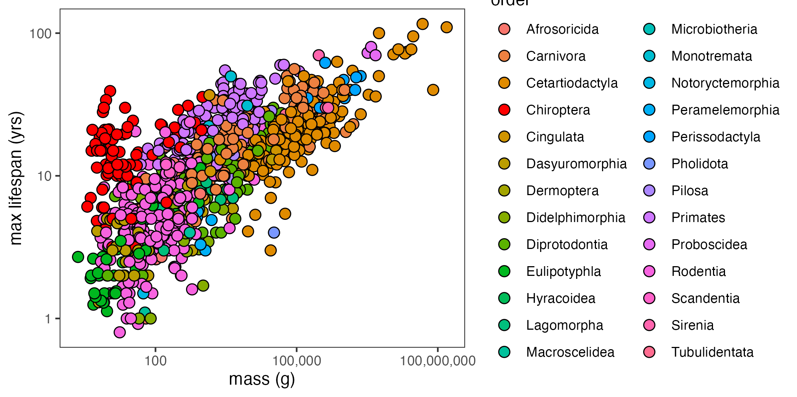

Now, run a GAM to determine the partial effect of host order (phylogeny)
on maximum longevity, and use this to predict mortality rates by order:

    library(mgcv)
    pan.dat$log10mass_g <- log10(pan.dat$mass_g)
    pan.dat$order <- as.factor(pan.dat$order)
    pan.dat$log10_max_lifespan_yrs <- log10(pan.dat$max_lifespan_yrs)

    m1 <- gam(log10_max_lifespan_yrs~s(log10mass_g, bs = "tp") +
                                      s(order, bs="re"),
                                      data = pan.dat)

    summary(m1) #deviance explained = 75.8%

    # And, plot the partial effects of order:
    # Source partial effects script from Mollentze and Streicker 2020:
    # This script includes two plotting functions, added by me!

    source(paste0(homewd,"source/mollentze-streicker-2020-functions.R"))

    order.dat <- get_partial_effects(m1, var="order")
    mass.dat <- get_partial_effects_continuous(m1, var="log10mass_g")

    p2a <- plot.partial(df=order.dat, var="order", response_var = "max lifespan (yrs)")
    p2b <- plot.partial.cont(df=mass.dat, var="log10mass_g",  response_var = "max lifespan (yrs)", alt_var = "mass (g)", log = T)

    p2 <- cowplot::plot_grid(p3a, p3b, ncol=1, nrow = 2, labels=c("A", "B"), label_x = .1)

Your plot should look like this:

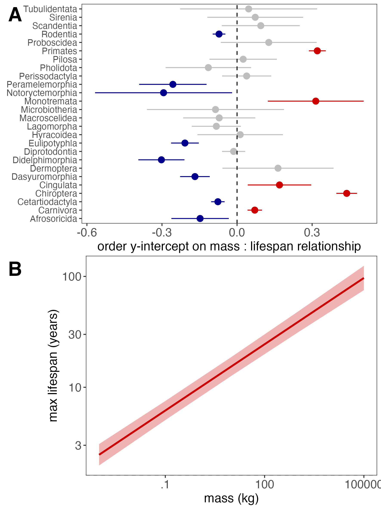

We see clear evidence of significant effects of host order on the
relationship between body mass and longevity.

In particular, significant positive associations with longevity,
indicative of orders with longer lifespans than predicted by body size,
are: 

1. Chiroptera 
2. Cingulata 
3. Monotremata 
4. Primates

Significant negative associations, indicative of orders with shorter
lifespans than predicted by body size are:

1.  Afrosoricida
2.  Dasyuromorphia
3.  Didelphimorphia
4.  Eulipotyphla
5.  Notoryctemorphia
6.  Peramelemorphia

Now, to parameterize $\mu$ , the annual mortality rate by order for our
within-host model, we can simply predict lifespan from our fitted GAM,
excluding the effects of body mass, then take the inverse:

    predict.dat <- cbind.data.frame(order = order.dat[[1]]$order, log10mass_g=1)
    # You can insert any value you like for "log10mass_g" since we won't 
    # be using it anyhow

    predict.dat$mu <- 1/(10^predict.gam(m1, newdata = predict.dat, exclude = "s(log10mass_g)", type="response"))
    predict.dat$mu_lci <- 1/(10^(predict.gam(m1, newdata = predict.dat, exclude = "s(log10mass_g)", type="response") -1.96*predict.gam(m1, newdata = predict.dat, exclude = "s(log10mass_g)", type="response", se.fit = T)$se))
    predict.dat$mu_uci <- 1/(10^(predict.gam(m1, newdata = predict.dat, exclude = "s(log10mass_g)", type="response") +1.96*predict.gam(m1, newdata = predict.dat, exclude = "s(log10mass_g)", type="response", se.fit = T)$se))

    predict.dat$mu_lci[predict.dat$mu_lci<0] <- 0
    predict.dat$mu_uci[predict.dat$mu_uci>1] <- 1

    # Also compute the number of data entries per order used to determine this:
    mu.sum <- ddply(pan.dat, .(order), summarise, N_mu = length(binomial))

    predict.dat <- merge(predict.dat, mu.sum, by="order", all.x = T)
    predict.dat <- dplyr::select(predict.dat, -(log10mass_g))

    # and plot your predictions by order for mass

    # first, get your null
    y.int = 1/(10^(predict.gam(m1, 
                        newdata = cbind.data.frame(order="Primates", log10mass_g = unique(order.dat[[1]]$log10mass_g)), 
                        exclude = "s(order)", type = "response")))

    # Now plot predictions against null:

    p3 <- ggplot(data=predict.dat) + 
          geom_point(aes(x=order, y=mu, fill=order, size=N_mu), pch=21) + 
          theme_bw()  + 
          theme(axis.text.x = element_text(angle = 90), axis.title.x = element_blank(),
                legend.position = c(.8,.91), legend.direction = "horizontal", legend.title = element_blank()) +
          scale_fill_manual(values=colz, guide="none") +
          scale_color_manual(values=colz) +
          geom_errorbar(aes(x=order, ymin=mu_lci, ymax=mu_uci, color=order), width=0, show.legend = F) +
          geom_hline(aes(yintercept=y.int), linetype=2) +
          ylab(bquote("predicted annual mortality rate by order,"~mu~"("~yrs^-1~")")) 

    p3

Your plot should look like this:

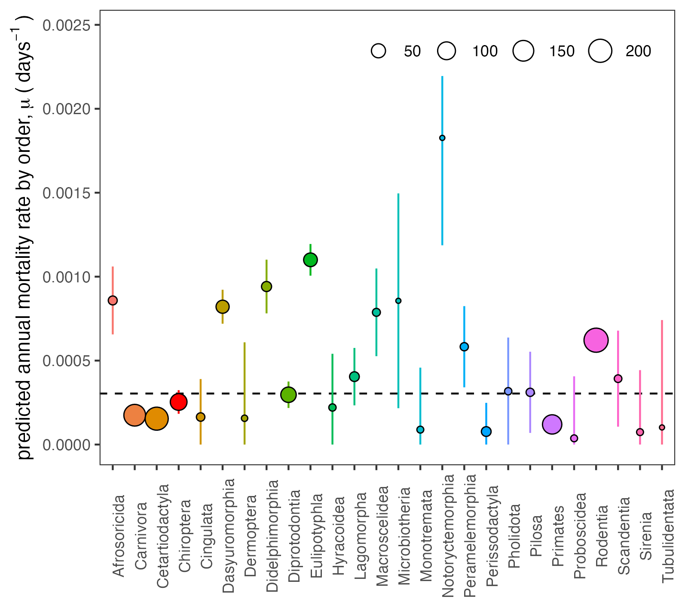

## Estimating host tolerance of immunopathology

Example Figure 1 above demonstrates the interaction of host order with
lifespan, demonstrating how some hosts of certain orders
(e.g. Chiroptera, Cingulata,Monotremata, Primates) are significantly
longer-lived and hosts of other orders are significantly shorter-lived
(e.g Afrosoricida, Dasyuromorphia, Didelphimorphia, Eulipotyphla,
Notoryctemorphia, Peramelemorphia) than predicted by their body mass.

We hypothesized that host longevity in excess of that predicted by body
size should be associated with highly efficient anti-aging pathways,
which are likely anti-inflammatory in nature. We additionally
hypothesized that these anti-inflammatory, anti-aging mechanisms might
also double as promoting host tolerance to the inflammation incurred by
immunopathology, a claim which is supported in the
[literature](https://www.nature.com/articles/s41598-017-12769-7).

As a result, we opted to parameterize ($T_w$), host tolerance of
immunopathology, from the same regression of host longevity against body
mass ([Example Fig. 1, above](briefFig1.png)). Since the raw values for
$T_w$ lack units in our within-host model, we can scale $T_w$ from the
partial effects of host order on the interaction between mass and
lifespan:

    # m1 from above should already be appropriate,
    # and Example Fig. 2 is also appropriate

    # Make tolerance (Tw) a scaled version of the order effect in this relationship
    # First, get high and low confidence and estimate from this plot and scale as Tw

    tmp.dat <- cbind.data.frame(order= order.dat[[1]]$order, estimate=order.dat[[1]]$y, conf.low=order.dat[[1]]$ylower, conf.high=order.dat[[1]]$yupper)

    # Our goal is for Tw to span 0 to 1 for complete tolerance assumptions
    # and be >1 for constant tolerance assumptions. We only allow for 
    # linear transformations of the data, in order to retain differences
    # in the magnitude of effect. We add to the predict.dat database from above
    # among the orders. 

    # Linear transformation: 
    # Constant tolerance: Make all effects positive, then add 1
    # Complete tolerance: Make all effects positive
    tmp.dat$Tw_constant <- tmp.dat$estimate + abs(min(tmp.dat$conf.low)) + 1
    tmp.dat$Tw_complete <- tmp.dat$estimate + abs(min(tmp.dat$conf.low))
    tmp.dat$Tw_constant_lci <- tmp.dat$conf.low + abs(min(tmp.dat$conf.low)) + 1
    tmp.dat$Tw_complete_lci <- tmp.dat$conf.low + abs(min(tmp.dat$conf.low))
    tmp.dat$Tw_constant_uci <- tmp.dat$conf.high + abs(min(tmp.dat$conf.low)) + 1
    tmp.dat$Tw_complete_uci <- tmp.dat$conf.high + abs(min(tmp.dat$conf.low))

    # Now merge with predict.dat
    tmp.dat <- dplyr::select(tmp.dat, order, Tw_constant, Tw_complete, Tw_constant_lci, Tw_constant_uci, Tw_complete_lci, Tw_complete_uci)

    predict.dat <- merge(predict.dat, tmp.dat, by="order", all.x = T)
    head(predict.dat)

    # Now calculate "N" (the number of observations upon which 
    # each parameter estimate is based) for Tw
    Tw.sum <- ddply(pan.dat, .(order), summarise, N_Tw=length(species))
    predict.dat <- merge(predict.dat, Tw.sum, by="order", all.x = T)

    head(predict.dat)
    # Now, plot it

    # Constant tolerance (Tw)
    p4a <- ggplot(data=predict.dat) + 
      geom_point(aes(x=order, y=Tw_constant, fill=order, size=N_Tw), pch=21) + 
      theme_bw() +
      theme(axis.text.x = element_text(angle = 90),axis.title.x = element_blank(),
            plot.margin = unit(c(.1,.1,.1,1.1), "lines"), legend.position = c(.82,.91),
              legend.direction = "horizontal", legend.title = element_blank()) +
      scale_fill_manual(values=colz, guide="none") +
      scale_color_manual(values=colz) +
      geom_errorbar(aes(x=order, ymin=Tw_constant_lci, ymax=Tw_constant_uci, color=order), width=0, show.legend = F) +
      geom_hline(aes(yintercept=1.5), linetype=2) + ylab(bquote("constant immunopathology tolerance,"~T[w]))

    # Complete tolerance (Tw)
    p4b <- ggplot(data=predict.dat) + 
      geom_point(aes(x=order, y=Tw_complete, fill=order, size=N_Tw), pch=21, show.legend = F) + 
      theme_bw() +
      scale_fill_manual(values=colz) +
      scale_color_manual(values=colz) +
      theme(axis.text.x = element_text(angle = 90), axis.title.x = element_blank(),
            plot.margin = unit(c(.1,.1,.1,1.1), "lines")) +
      geom_errorbar(aes(x=order, ymin=Tw_complete_lci, ymax=Tw_complete_uci, color=order), width=0, show.legend = F) +
      geom_hline(aes(yintercept=.5), linetype=2) + ylab(bquote("complete immunopathology tolerancem,"~T[w]))

    # Visualize:
    p4 <- cowplot::plot_grid(p4a, p4b, ncol=1, nrow = 2, labels=c("A", "B"), label_x = 0)

    p4 

Your plot should look like this:

Since these relationships are derived from the same model, we identify
the same positive associations with tolerance of immunopathology as we
do with longevity above.

## Estimating magnitude of host constitutive immunity

Next, we sought to parameterize $g_0$ , the magnitude of constitutive
host immunity.

Prior work in the empirical literature shows that baseline blood
concentrations of neutrophils, a broad class of leukocyte involved in
innate mammalian immunity, scales positively (and hypermetrically) with
body size across mammals ([Downs et
al. 2020](https://www.journals.uchicago.edu/doi/full/10.1086/706235)),
and is also correlated with mating promiscuity in primates ([Nunn et
al. 2000](https://www.science.org/doi/10.1126/science.290.5494.1168))
and mating promiscuity and sociality in carnivores ([Nunn et
al. 2003](https://royalsocietypublishing.org/doi/abs/10.1098/rspb.2002.2249)).
Additional empirical work demonstrates that bacterial killing ability
(BKA, a measure of innate immune capacity of the complement) is
negatively associated with mass-adjusted basal metabolic rates (BMR, and
therefore positively associated with body mass) between species of
tropical bird ([Tieleman et
al. 2005](https://doi.org/10.1098/rspb.2005.3155)). Birds heterophils
(the equivalent of mammalian neutrophils) are also known to correlate
positively (and hypermetrically) with mass ([Ruhs et
al. 2020](https://doi.org/10.1098/rspb.2020.0655)), and BMR has also
been shown to be negatively correlated with heterophil concentrations
and agglutination and lysis scores (innate immune metrics similar to
BKA) in European birds ([Pap et
al. 2011](https://link.springer.com/article/10.1007/s00442-014-3108-2)).

The theoretical literature additionally predicts that the magnitude of
investment in constitutive immunity should increase with host exposure
to parasites ([Westra et
al. 2015](https://doi.org/10.1016/j.cub.2015.01.065)) and higher host
densities ([Boots and Best
2018](https://doi.org/10.1098/rspb.2018.0658)).

Because data on reliable data on host exposure rates and densities are
largely lacking across mammalian orders (thereby limiting our ability to
test theoretical predictions), we chose to build on prior empirical work
and use baseline blood concentrations of neutrophils as a proxy for
$g_0$ across orders. We walk through our analyses of these cross-order
neutrophil concentrations in the following steps.

First, we downloaded data pairing neutrophil concentrations across 246
mammalian species and spanning 19 distinct orders from the [Species360
database](https://zims.species360.org/) and linked it with data from
[Jones et al. 2009](https://doi.org/10.1890/08-1494.1) and [Healy et.
al. 2014](https://doi.org/10.1098/rspb.2014.0298), highlighted above.
Note that we are not able to include the raw neutrophil data file in
this github, as a result of datasharing restrictions from Species360.
However, should you be interested in using it, please email
corresponding author, Cara Brook at
[cbrook@uchicago.edu](cbrook@uchicago.edu) :

    # First, load the data
    wbc.dat <- read.csv(file = "species_360_neut.csv", header=TRUE, stringsAsFactors = FALSE)
    head(wbc.dat)

    names(wbc.dat)[names(wbc.dat)=="phylo"] <- "binomial"

    unique(wbc.dat$Order)

    #Rename
    names(wbc.dat)[names(wbc.dat)=="Segmented.neutrophils"] <- "neutro_conc"
    #names(wbc.dat)[names(wbc.dat)=="AdultBodyMass"] <- "mass_g"
    names(wbc.dat)[1:4] <- c("order", "family", "genus", "species")

    #and merge with features from pan.dat
    pan.bmr <- dplyr::select(pan.dat, binomial, mass_g, log10mass_g, max_lifespan_yrs, log10_max_lifespan_yrs, BMR_W, BMR_W_g)#, pop_group_size, pop_density_N_km2, homerange_km2)

    wbc.dat <- merge(wbc.dat, pan.bmr, by="binomial", all.x = T)

    head(wbc.dat)
    wbc.dat$ln10neutro <- log10(wbc.dat$neutro_conc)
    length(wbc.dat$mass_g[is.na(wbc.dat$mass_g)]) #102 with no mass
    length(wbc.dat$mass_g[is.na(wbc.dat$max_lifespan_yrs)]) #102 with no lifespan
    length(wbc.dat$mass_g[is.na(wbc.dat$BMR_W)]) #323 with no BMR

We then plotted relationships between log10 neutrophil concentration and
log10 host body mass:

    # Slim your colors down to only those in this dataset
    colz2 = sort(colz[unique(wbc.dat$order)])

    wbc.dat$order <- as.factor(wbc.dat$order)

    # Plot with mass
    p5 <- ggplot(wbc.dat) + 
      geom_point(aes(x=mass_g, y=neutro_conc, fill=order), size =3, pch=21) +  
      theme_bw() + scale_y_log10() + scale_x_log10(labels=scales::comma) +
      scale_fill_manual(values=colz2) +
      theme(panel.grid = element_blank()) +
      xlab("mass (g)") + ylab(bquote("neutrophil concentrations ("~10^9~"cells/L)"))
    p5

Producing a plot like this:

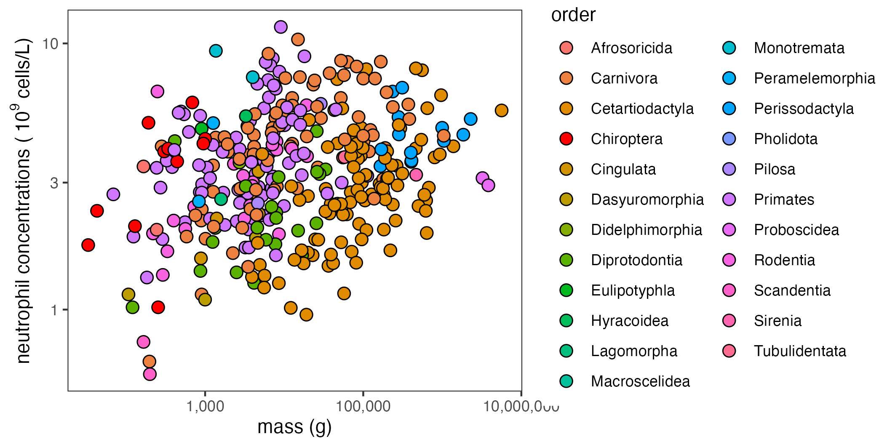

Then, we additionally explored scaling with mass-specific basal
metabolis rate (BMR):

    # BMR plot 
    p6 <- ggplot(wbc.dat) + 
      geom_point(aes(x=BMR_W_g, y=neutro_conc, fill=order), size =3, pch=21) +  
      theme_bw() + scale_y_log10() + scale_x_log10(labels=scales::comma) +
      scale_fill_manual(values=colz2) +
      theme(panel.grid = element_blank()) +
      xlab("mass-specific BMR (W/g)") + ylab(bquote("neutrophil concentrations ("~10^9~"cells/L)"))
    p6

Producing a plot like this:

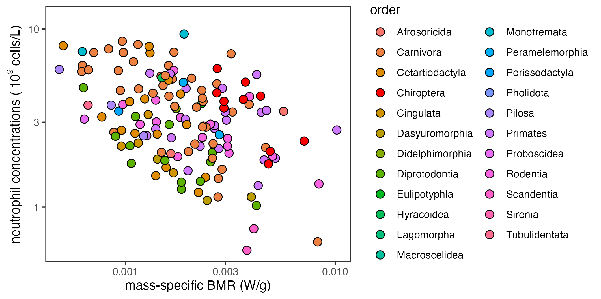

Next, we explored statistical correlates of neutrophil concentration,
investigating models incorporating body mass and order only, as compared
with those also examining BMR. We found stronger support for a model of
mass-specific BMR than for body size alone, and thus, used this as a
predictor of constitutive immunity:

    wbc.dat$ln10BMR_W_g <- log10(wbc.dat$BMR_W_g)

    wbc.dat$order <- as.factor(wbc.dat$order)

    m2a <- gam(ln10neutro~s(ln10BMR_W_g, bs="tp") +
                s(order, bs="re"),
              data=wbc.dat)
    summary(m2a) #51.8%; n =144

    wbc.pred = cbind.data.frame(ln10BMR_W_g=seq(min(wbc.dat$ln10BMR_W_g, na.rm=T),  max(wbc.dat$ln10BMR_W_g, na.rm=T), length=2),  order = "Chiroptera")
    wbc.pred$predict_neut <- 10^(predict.gam(m2a, newdata = wbc.pred, exclude = "s(order)"))
    wbc.pred$BMR_W_g <- 10^(wbc.pred$ln10BMR_W_g)

    # Significant negative associations with:
    # Cetartiodactyal, Dasyuromorphia, Diprotodontia, Proboscidea, Scandentua

    #Significant positive associations with:
    # Monotremata, Primates

    # Or try including BMR
    m3 <- gam(ln10neutro~s(ln10mass, bs="tp") +
                          s(BMR_W, bs="tp") +
                          s(order, bs="re"),
                          data=wbc.dat)
    summary(m3) #63.5%; n=144. much stronger model fit
    order.dat <- get_partial_effects(m3, var="order")
    mass.dat <- get_partial_effects_continuous(m3, var="ln10mass")
    BMR.dat <- get_partial_effects_continuous(m3, var="BMR_W")

    p7a <- plot.partial(order.dat, var="order", response_var = "log10 neutrophils")
    p7b <- plot.partial.cont(mass.dat, var="ln10mass", log = T, alt_var = "mass (g)", response_var = "log10 neutrophils")
    p7c <- plot.partial.cont(BMR.dat, var="BMR_W", log = F, alt_var = "BMR (W)", response_var = "log10 neutrophils")

    #and plot together

    p7 <- cowplot::plot_grid(p7a, p7b, p7c, ncol=1, nrow = 3, labels=c("A", "B", "C"), label_x = 0.09)

This resulting in the following plot:

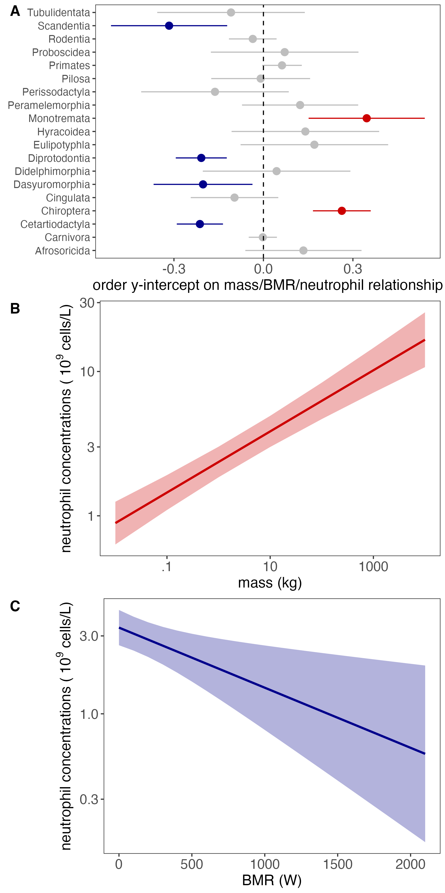

We see significant positive associations with neutrophil concentrations
(indicative of robust constitutive immunity for body size and BMR
predictions) for the following orders: 1. Chiroptera 2. Monotremata

We see significant negative associations (indicative of weak
constitutive immunity for body size and BMR predictions) for the
following orders:

1.  Cetartiodactyal
2.  Diprotodontia
3.  Dasyuromorphia
4.  Proboscidea
5.  Scandentia

We can then use the fitted model to estimate $g_0$ for our within-host
model. Our goal is for $g_0$ to span 0 to 1 for model parameterization.
We only allow for linear transformations of the data, in order to retain
differences in the magnitude of effect. We add to the predict.dat
database from above among the orders and plot $g_0$ across orders:

    tmp.dat <- cbind.data.frame(order= order.dat[[1]]$order, estimate=order.dat[[1]]$y, conf.low=order.dat[[1]]$ylower, conf.high=order.dat[[1]]$yupper)

    # Linear transformation: 
    # g0: Make all effects positive
    tmp.dat$g0 <- tmp.dat$estimate + abs(min(tmp.dat$conf.low))
    tmp.dat$g0_lci <- tmp.dat$conf.low + abs(min(tmp.dat$conf.low))
    tmp.dat$g0_uci <- tmp.dat$conf.high + abs(min(tmp.dat$conf.low))

    # Now merge with predict.dat
    tmp.dat <- dplyr::select(tmp.dat, order, g0, g0_lci, g0_uci)

    predict.dat <- merge(predict.dat, tmp.dat, by="order", all.x = T)
    head(predict.dat)

    # Now calculate "N" (the number of observations upon which 
    # each parameter estimate is based) for g0
    g0.sum <- ddply(wbc.dat, .(order), summarise, N_g0=length(binomial))
    predict.dat <- merge(predict.dat, g0.sum, by="order", all.x = T)

    head(predict.dat)

    p8 <- ggplot(data=subset(predict.dat, !is.na(g0))) + 
      geom_point(aes(x=order, y=g0, fill=order, size=N_g0), pch=21) + 
      theme_bw() +
      theme(axis.text.x = element_text(angle = 90),axis.title.x = element_blank(),
            plot.margin = unit(c(.1,.1,.1,1.1), "lines"),
            legend.position = c(.75,.92),
            legend.direction = "horizontal",
            legend.title = element_blank()) +
      geom_errorbar(aes(x=order, ymin=g0_lci, ymax=g0_uci, color=order), width=0, show.legend = F) +
      scale_color_manual(values=colz2) +
      scale_fill_manual(values=colz2, guide="none") +
      geom_hline(aes(yintercept=0.5), linetype=2) + ylab(bquote("magnitude constitutive immunity, "~g[0]))

    p8

Your plot should look like this:

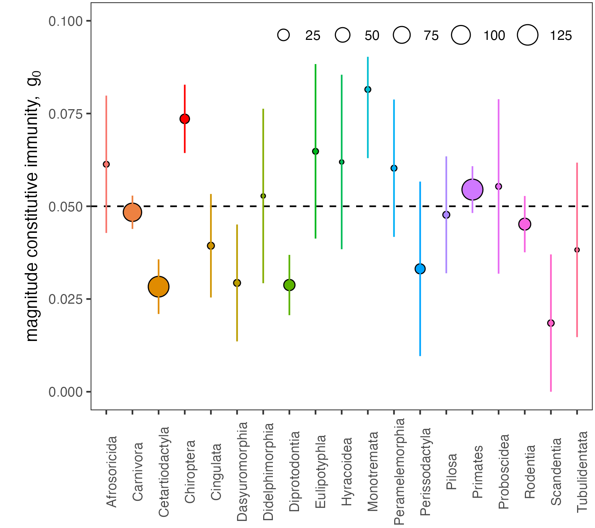

## Estimating spillover host tolerance from phylogenetic distance

Finally, in our equation for spillover virulence, we define one final
parameter, $T_{vS}$, the spillover host tolerance of virus-induced
pathology for a pathogen evolved in a phylogenetically-distant reservoir
host. Building from the literature (e.g. [Guth et
al. 2019](https://doi.org/10.1098/rstb.2019.0296), [Guth et
al. 2022](https://doi.org/10.1073/pnas.2113628119), [Farrell and Davies
2019](https://doi.org/10.1073/pnas.1817323116), [Longdon et
al. 2011](https://doi.org/10.1371/journal.ppat.1002260), [Longdon et
al. 2015](https://doi.org/10.1371/journal.ppat.1004728)), we chose to
model this viral tolerance as a function of phylogenetic distance
between spillover and reservoir host.

To do this, we first used the database TimeTree (timetree.org) to build
a phylogeny and extract the phylogenetic distance (in millions of
years), based on Most Recent Common Ancestor across all 27 mammalian
orders modeled in our Pantheria dataset. See subfolder
[phylo-tree/get.phylo.dist.R](phylo-tree/get.phylo.dist.R) for details
of this analysis.

Here, we estimate the $T_{vS}$ parameter from these relationships and
plot across mammalian orders:

    # Load the tree data
    load(paste0(homewd, "phylo-tree/phylo.dat.final.Rdata"))

    # Merge the phylogenetic distance (eta_R) into the existing tree
    predict.dat <- merge(predict.dat, phylo.dat, by="order", all.x = T, sort=F)

    head(predict.dat)

    # Now, estimate Tv_human (Tv_S), using similar scaling as above for Tw:
    # Constant tolerance needs to be >1 and 
    # Complete tolerance needs to be >0 and <1

    # Here, small phylogenetic distance equates to high tolerance, so we
    # subtract from 2 and 1 rather than adding:
    predict.dat$Tv_human_constant <- 2-(predict.dat$phylo_dist/max(predict.dat$phylo_dist, na.rm=T))
    predict.dat$Tv_human_complete <- 1-(predict.dat$phylo_dist/max(predict.dat$phylo_dist, na.rm=T))

    # Visualize both constant (p4a) and complete (p4b) estimates for Tvs
    p9a <- ggplot(data=predict.dat) + theme_bw() +
            geom_point(aes(x=order, y=Tv_human_constant, fill=order), pch=21, show.legend = F, size=3) + 
            scale_fill_manual(values=colz) + ylab(bquote("constant viral spillover tolerance,"~T[vS])) +
            theme(axis.text.x = element_blank(), axis.ticks.x = element_blank(),
                  axis.title.x = element_blank(),
                  plot.margin = unit(c(.1,.1,0,.5), "lines")) +
            geom_hline(aes(yintercept=1.5), linetype=2)
    p9b <- ggplot(data=predict.dat) + theme_bw() +
           geom_point(aes(x=order, y=Tv_human_complete, fill=order), pch=21, show.legend = F, size=3) + 
           scale_fill_manual(values=colz) + ylab(bquote("complete viral spillover tolerance,"~T[vS])) +
           theme(axis.text.x = element_text(angle = 90), axis.title.x = element_blank(),
                 plot.margin = unit(c(0,.1,.1,.5), "lines")) +
          geom_hline(aes(yintercept=0.5), linetype=2)

    p9 <- cowplot::plot_grid(p9a, p9b, ncol=1, nrow = 2, labels=c("A", "B"), rel_heights = c(1,1.3), label_x = -0.01)

The resulting plot should look like this:

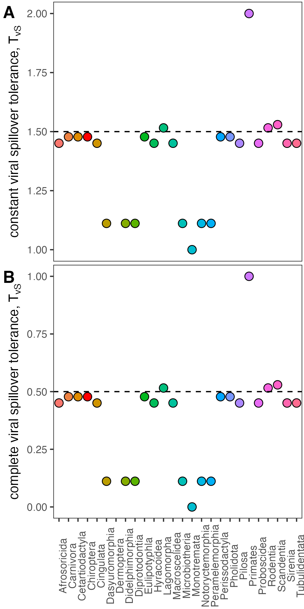

This scales spillover viral tolerance based on relative phylogenetic
distance between each mammalian reservoir order and humans. Humans
demonstrate highest tolerance to viruses spilling over from Primates
(which share the same evolutionary divergence time as humans) and the
lowest tolerance to viruses spilling over from the most phylogenetically
distant marsupial orders (e.g. Monotremata, Dasyuormorphia,
Didelphimorphia, Diprotodontia, Microbiotheria, Notoryctemorphia,
Peramelemorphia).

## Estimating optimal virus growth rates (r\*) in reservoir hosts

Now take all the predict.dat outputs and merge them into a prediction
for $r^*$, the optimal virus growth rate evolved in various mammalian
reservoir hosts.

Set all other within-host parameters to the same default parameter
values used to generate Fig. 2 in the main text and allow $\mu$, $T[w]$,
and $g_0$ to vary by order based on the analyses outlined above. Relate
these parameters to a prediction of $r^*$, based on mathematical
derivations outlined in detail in the Supplementary Appendix of our
paper.

    # First, make a list of default within-host parameters, suing the same values from main text Fig. 2.
    # The values for g0, Tw, Tv, and mu will get overwritten, so it does not really matter what you put here.

    vir.par <- list(b= .2, q = .0002, c=.5,  m=1/(21), g=.9, g0 = .5, zeta=.2, v=1, w=1, gamma=.001, Tv=.005, Tw=.005, mu = 1/(20*365))

    # Constant tolerance rstar predictions using order-specific g0, Tw, and mu
    # and default values for all other parameters
    predict.dat$rstar_constant <- (vir.par$c*predict.dat$g0/vir.par$m) + (sqrt((vir.par$m^2)*(vir.par$c^2)*vir.par$g*predict.dat$g0*predict.dat$mu*predict.dat$Tw_constant*vir.par$Tv*(vir.par$v*predict.dat$Tw_constant+vir.par$g*vir.par$w*vir.par$Tv)))/((vir.par$v*(vir.par$m^2)*predict.dat$Tw_constant) +(vir.par$g*vir.par$w*(vir.par$m^2)*vir.par$Tv))
    predict.dat$rstar_constant_lci <- (vir.par$c*predict.dat$g0_lci/vir.par$m) + (sqrt((vir.par$m^2)*(vir.par$c^2)*vir.par$g*predict.dat$g0_lci*predict.dat$mu_lci*predict.dat$Tw_constant_lci*vir.par$Tv*(vir.par$v*predict.dat$Tw_constant_lci+vir.par$g*vir.par$w*vir.par$Tv)))/((vir.par$v*(vir.par$m^2)*predict.dat$Tw_constant_lci) +(vir.par$g*vir.par$w*(vir.par$m^2)*vir.par$Tv))
    predict.dat$rstar_constant_uci <- (vir.par$c*predict.dat$g0_uci/vir.par$m) + (sqrt((vir.par$m^2)*(vir.par$c^2)*vir.par$g*predict.dat$g0_uci*predict.dat$mu_uci*predict.dat$Tw_constant_uci*vir.par$Tv*(vir.par$v*predict.dat$Tw_constant_uci+vir.par$g*vir.par$w*vir.par$Tv)))/((vir.par$v*(vir.par$m^2)*predict.dat$Tw_constant_uci) +(vir.par$g*vir.par$w*(vir.par$m^2)*vir.par$Tv))

    # Complete rstar predictions using  order-specific g0, Tw, and mu
    # and default values for all other parameters
    predict.dat$rstar_complete <- (vir.par$c*predict.dat$g0/vir.par$m) + ((vir.par$c^2)*vir.par$g*predict.dat$g0*predict.dat$mu)/(sqrt((vir.par$m^2)*(vir.par$c^2)*predict.dat$mu*vir.par$g*predict.dat$g0*(vir.par$g*vir.par$w+vir.par$v-vir.par$g*predict.dat$Tw_complete-vir.par$Tv)))
    predict.dat$rstar_complete_lci <- (vir.par$c*predict.dat$g0_lci/vir.par$m) + ((vir.par$c^2)*vir.par$g*predict.dat$g0_lci*predict.dat$mu_lci)/(sqrt((vir.par$m^2)*(vir.par$c^2)*predict.dat$mu_lci*vir.par$g*predict.dat$g0_lci*(vir.par$g*vir.par$w+vir.par$v-vir.par$g*predict.dat$Tw_complete_lci-vir.par$Tv)))
    predict.dat$rstar_complete_lci[is.na(predict.dat$rstar_complete_lci)] <- 0
    predict.dat$rstar_complete_uci <- (vir.par$c*predict.dat$g0_uci/vir.par$m) + ((vir.par$c^2)*vir.par$g*predict.dat$g0_uci*predict.dat$mu_uci)/(sqrt((vir.par$m^2)*(vir.par$c^2)*predict.dat$mu_uci*vir.par$g*predict.dat$g0_uci*(vir.par$g*vir.par$w+vir.par$v-vir.par$g*predict.dat$Tw_complete_uci-vir.par$Tv)))

    # Then, get mean N across all the factors that went in to each prediction
    predict.dat$N_cumulative <-rowMeans(cbind(predict.dat$N_mu, predict.dat$N_Tw, predict.dat$N_g0))
    predict.dat <- arrange(predict.dat, desc(alpha_star_human_constant), desc(N_cumulative))
    predict.dat$order <- factor(predict.dat$order, levels = unique(predict.dat$order))

    # Then, visualize rstar by order

    p10a <- ggplot(data=subset(predict.dat, !is.na(g0))) + 
      geom_errorbar(aes(x=order, ymin=rstar_constant_lci, ymax=rstar_constant_uci, color=order),  width=0, linetype=3, show.legend = F) +
      geom_point(aes(x=order, y=rstar_constant, fill=order, size=N_cumulative), pch=21) +
      scale_color_manual(values=colz)+
      scale_fill_manual(values=colz, guide="none")+theme_bw() +
      theme(axis.text.x = element_blank(), axis.ticks.x = element_blank(),
            axis.title.x = element_blank(),
            panel.grid = element_blank(),
            legend.title = element_blank(), legend.direction = "horizontal",
            legend.position = c(.75,.9),
            plot.margin = unit(c(.1,.1,0,.8), "lines")) +
      ylab(bquote("optimal virus growth rate in reservoir,"~r~"* (constant)"))

    p10b <- ggplot(data=subset(predict.dat, !is.na(g0))) + 
      geom_errorbar(aes(x=order, ymin=rstar_complete_lci, ymax=rstar_complete_uci, color=order),  width=0, linetype=3, show.legend = F) +
      geom_point(aes(x=order, y=rstar_complete, fill=order, size=N_cumulative), pch=21, show.legend = F) +
      scale_color_manual(values=colz)+
      scale_fill_manual(values=colz, guide="none")+theme_bw() +
      theme(axis.text.x = element_text(angle = 90),
            axis.title.x = element_blank(),
            panel.grid = element_blank(),
            plot.margin = unit(c(.1,.1,.1,.5), "lines")) +
      ylab(bquote("optimal virus growth rate in reservoir,"~r~"* (complete)"))

    p10 <- cowplot::plot_grid(p10a, p10b, ncol=1, nrow = 2, labels=c("A", "B"), rel_heights = c(1,1.3), label_x = -0.01)

The resulting plot should look like this:

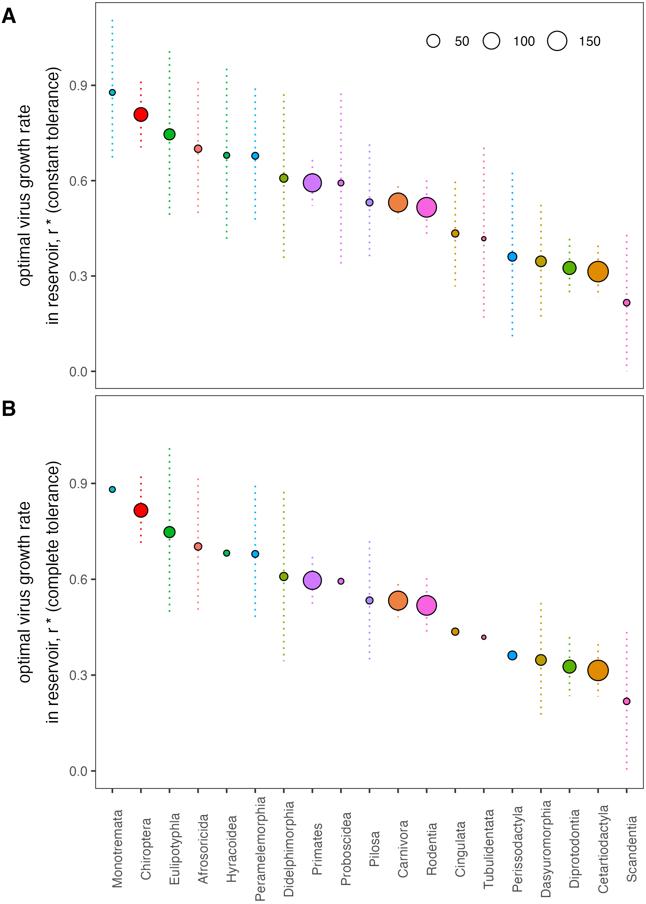

## Estimating spillover virulence ($\alpha*_S$) in human hosts

Virulence in the human host is a function of phylogenetic distance,
which we capture in order-specific $T_{vS}$. Following spillover,
tolerance of immunopathology is now a property of the spillover host
(here, human), so we hold it constant across all reservoir predictions.
As above, calculations of spillover virulence are derived from the
equations shown in the Supplementary Appendix of our paper.

We calculate and plot this spillover virulence here:

    # First, calculate Vmax in the human host:
    predict.dat$Vs_max_constant <- predict.dat$rstar_constant/(vir.par$g*vir.par$c) - predict.dat$rstar_constant/(2*vir.par$g*vir.par$c) + 1 - 1/(vir.par$g) + vir.par$c/(2*predict.dat$rstar_constant*vir.par$g)
    predict.dat$Vs_max_constant_lci <- predict.dat$rstar_constant_lci/(vir.par$g*vir.par$c) - predict.dat$rstar_constant_lci/(2*vir.par$g*vir.par$c) + 1 - 1/(vir.par$g) + vir.par$c/(2*predict.dat$rstar_constant_lci*vir.par$g)
    predict.dat$Vs_max_constant_uci <- predict.dat$rstar_constant_uci/(vir.par$g*vir.par$c) - predict.dat$rstar_constant_uci/(2*vir.par$g*vir.par$c) + 1 - 1/(vir.par$g) + vir.par$c/(2*predict.dat$rstar_constant_uci*vir.par$g)

    predict.dat$Vs_max_complete <- predict.dat$rstar_complete/(vir.par$g*vir.par$c) - predict.dat$rstar_complete/(2*vir.par$g*vir.par$c) + 1 - 1/(vir.par$g) + vir.par$c/(2*predict.dat$rstar_complete*vir.par$g)
    predict.dat$Vs_max_complete_lci <- predict.dat$rstar_complete_lci/(vir.par$g*vir.par$c) - predict.dat$rstar_complete_lci/(2*vir.par$g*vir.par$c) + 1 - 1/(vir.par$g) + vir.par$c/(2*predict.dat$rstar_complete_lci*vir.par$g)
    predict.dat$Vs_max_complete_uci <- predict.dat$rstar_complete_uci/(vir.par$g*vir.par$c) - predict.dat$rstar_complete_uci/(2*vir.par$g*vir.par$c) + 1 - 1/(vir.par$g) + vir.par$c/(2*predict.dat$rstar_complete_uci*vir.par$g)

    # Next, take that viral load and calculate spillover virulence, here for the constant tolerance assumption:
    vir.par$Tw = 1
    predict.dat$alpha_star_human_constant <- ((predict.dat$rstar_constant*vir.par$v)/predict.dat$Tv_human_constant  + (vir.par$g*vir.par$w*predict.dat$rstar_constant)/vir.par$Tw)*predict.dat$Vs_max_constant
    predict.dat$alpha_star_human_constant_lci <- ((predict.dat$rstar_constant_lci*vir.par$v)/predict.dat$Tv_human_constant  + (vir.par$g*vir.par$w*predict.dat$rstar_constant_lci)/vir.par$Tw)*predict.dat$Vs_max_constant_lci
    predict.dat$alpha_star_human_constant_uci <- ((predict.dat$rstar_constant_uci*vir.par$v)/predict.dat$Tv_human_constant  + (vir.par$g*vir.par$w*predict.dat$rstar_constant_uci)/vir.par$Tw)*predict.dat$Vs_max_constant_uci

    # And here for complete tolerance:
    vir.par$Tw = 0
    predict.dat$alpha_star_human_complete <- (predict.dat$rstar_complete*(vir.par$v-predict.dat$Tv_human_complete) + predict.dat$rstar_complete*vir.par$g*(vir.par$w-vir.par$Tw))*predict.dat$Vs_max_complete
    predict.dat$alpha_star_human_complete_lci <- (predict.dat$rstar_complete_lci*(vir.par$v-predict.dat$Tv_human_complete) + predict.dat$rstar_complete_lci*vir.par$g*(vir.par$w-vir.par$Tw))*predict.dat$Vs_max_complete_lci
    predict.dat$alpha_star_human_complete_uci <- (predict.dat$rstar_complete_uci*(vir.par$v-predict.dat$Tv_human_complete) + predict.dat$rstar_complete_uci*vir.par$g*(vir.par$w-vir.par$Tw))*predict.dat$Vs_max_complete_uci

    # Now, we rank by virulence, then confidence, and plot...
    predict.dat <- arrange(predict.dat, desc(alpha_star_human_complete), desc(N_cumulative))
    predict.dat$order <- factor(predict.dat$order, levels = unique(predict.dat$order))

    # Visualize alphastar in humans

    # Constant
    p11a <- ggplot(data=subset(predict.dat, !is.na(g0))) + 
      geom_errorbar(aes(x=order, ymin=alpha_star_human_constant_lci, ymax=alpha_star_human_constant_uci, color=order),  width=0, linetype=3, show.legend = F) +
      geom_point(aes(x=order, y=alpha_star_human_constant, fill=order, size=N_cumulative), pch=21) +
      scale_color_manual(values=colz)+
      scale_fill_manual(values=colz, guide="none")+theme_bw() +
      theme(axis.text.x = element_blank(), axis.ticks.x = element_blank(),
            axis.title.x = element_blank(),
            panel.grid = element_blank(),
            legend.title = element_blank(), legend.direction = "horizontal",
            legend.position = c(.75,.9),
            plot.margin = unit(c(.1,.1,0,.8), "lines")) +
      ylab(bquote("spillover virulence,"~alpha[S]~"(constant tolerance)"))
      

    predict.dat <- arrange(predict.dat, desc(alpha_star_human_complete), desc(N_cumulative))
    predict.dat$order <- factor(predict.dat$order, levels = unique(predict.dat$order))

    # Complete
    p11b <- ggplot(data=subset(predict.dat, !is.na(g0))) + 
      geom_errorbar(aes(x=order, ymin=alpha_star_human_complete_lci, ymax=alpha_star_human_complete_uci, color=order),  width=0, linetype=3, show.legend = F) +
      geom_point(aes(x=order, y=alpha_star_human_complete, fill=order, size=N_cumulative), pch=21, show.legend = F) +
      scale_color_manual(values=colz)+
      scale_fill_manual(values=colz, guide="none")+theme_bw() +
      theme(axis.text.x = element_text(angle = 90),
            axis.title.x = element_blank(),
            panel.grid = element_blank(),
            plot.margin = unit(c(.1,.1,.1,.5), "lines")) +
      ylab(bquote("spillover virulence,"~alpha[S]~"(complete tolerance)"))

    # Visualize together
    p11 <- cowplot::plot_grid(p11a, p11b, ncol=1, nrow = 2, labels=c("A", "B"), rel_heights = c(1,1.3), label_x = -0.01)

The resulting plot should look like this:

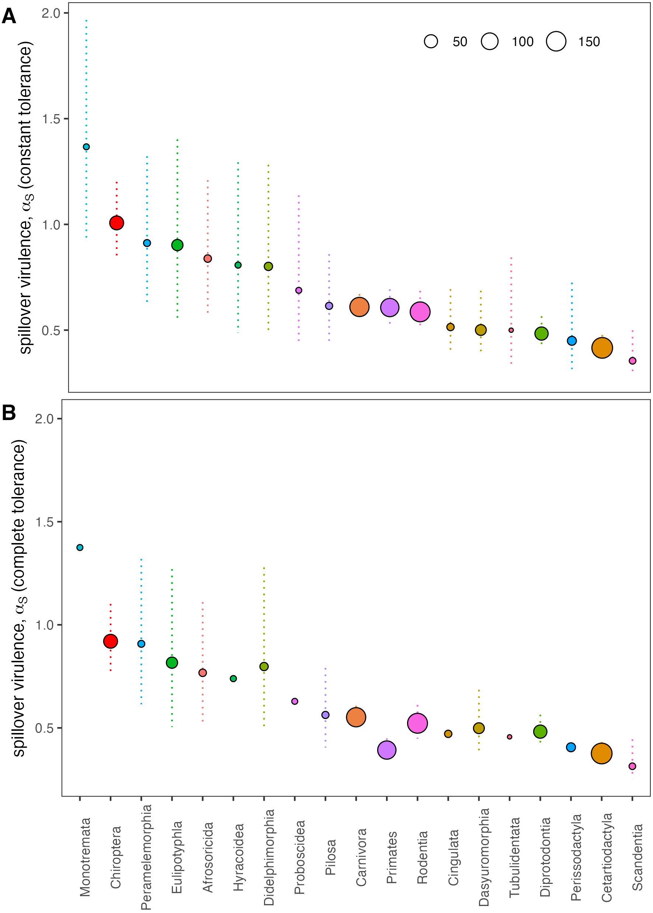

## Comparison with the literature

We compiled literature-derived estimates for mammalian order-level
averages of case fatality rates (CFRs) for viral zoonoses following
spillover into a human host in [Guth et
al. 2022](https://doi.org/10.1073/pnas.2113628119). In the [source
subfolder](source/guth-2021-cfr-virus-exclude.R), we convert these CFR
averages to virulence averages using data on the average duration of
infection. Here, we plot the relative magnitude of these values by order
and compare with our predictions from life history data encapsulated in
our within-host model (above).

First, load GAM data adapted from [Guth et
al. 2022](https://doi.org/10.1073/pnas.2113628119) and plot as
$\alpha_S^*$ estimates by order, derived from the literature:

    load(paste0(homewd,"source/gam.dat.Guth.et.al.2021.Rdata"))

    # Plot alpha_S for real
    p12 <- ggplot(data=gam.dat) + 
      geom_errorbar(aes(x=hOrder, ymin=alpha_lci, ymax=alpha_uci, color=hOrder),  width=0, linetype=3, show.legend=F) +
      geom_point(aes(hOrder, alpha, color=hOrder, size=Nobs), show.legend=F) + 
      theme_bw() +
      scale_color_manual(values=colz) +
      theme(panel.grid = element_blank(), axis.title.x = element_blank(), axis.title.y = element_text(size=14),
            axis.text.y = element_text(size=12), axis.text.x = element_text(size=12, angle = 90), legend.title = element_blank()) + 
      ylab(bquote("predicted"~alpha[S]~"by order ("~days^-1~")")) #+ coord_cartesian(ylim=c(0,100))

    p12

The resulting plot should look like this:

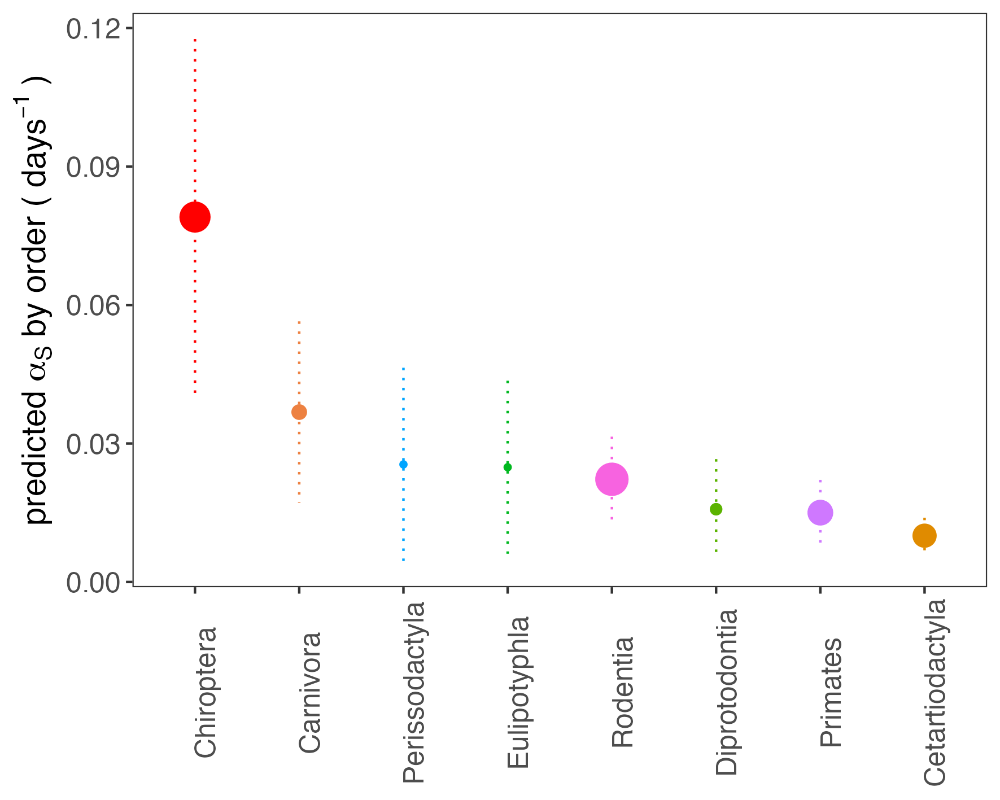

Next, scale these literature-derived estimates of spillover virulence to
a relative magnitude and compare against predictions from the
within-host model:

    #rank by descending alpha, then confidence
    gam.dat <- arrange(gam.dat, desc(alpha), desc(Nobs))

    # Merge our nested model predictions with those from Guth et al. 2022

    # Make columns match
    head(gam.dat)
    names(gam.dat)[1] <- "order"
    names(gam.dat)[3] <- "N"
    names(predict.dat)[names(predict.dat)=="N_cumulative"] <- "N"
    head(predict.dat)

    # And rescale alpha in both vectors

    # Constant
    predict.dat$alpha_star_human_constant[!is.na(predict.dat$alpha_star_human_constant)] <- scales::rescale(x =predict.dat$alpha_star_human_constant[!is.na(predict.dat$alpha_star_human_constant)], from=c(min(predict.dat$alpha_star_human_constant_lci, na.rm = T), max(predict.dat$alpha_star_human_constant_uci, na.rm = T)), to =c(0,1)) 
    predict.dat$alpha_star_human_constant_lci[!is.na(predict.dat$alpha_star_human_constant_lci)] <- scales::rescale(x =predict.dat$alpha_star_human_constant_lci[!is.na(predict.dat$alpha_star_human_constant_lci)], from=c(min(predict.dat$alpha_star_human_constant_lci, na.rm = T), max(predict.dat$alpha_star_human_constant_uci, na.rm = T)), to =c(0,1)) 
    predict.dat$alpha_star_human_constant_uci[!is.na(predict.dat$alpha_star_human_constant_uci)] <- scales::rescale(x =predict.dat$alpha_star_human_constant_uci[!is.na(predict.dat$alpha_star_human_constant_uci)], from=c(min(predict.dat$alpha_star_human_constant_lci, na.rm = T), max(predict.dat$alpha_star_human_constant_uci, na.rm = T)), to =c(0,1)) 

    # Complete
    predict.dat$alpha_star_human_complete[!is.na(predict.dat$alpha_star_human_complete)] <- scales::rescale(x =predict.dat$alpha_star_human_complete[!is.na(predict.dat$alpha_star_human_complete)], from=c(min(predict.dat$alpha_star_human_complete_lci, na.rm = T), max(predict.dat$alpha_star_human_complete_uci, na.rm = T)), to =c(0,1)) 
    predict.dat$alpha_star_human_complete_lci[!is.na(predict.dat$alpha_star_human_complete_lci)] <- scales::rescale(x =predict.dat$alpha_star_human_complete_lci[!is.na(predict.dat$alpha_star_human_complete_lci)], from=c(min(predict.dat$alpha_star_human_complete_lci, na.rm = T), max(predict.dat$alpha_star_human_complete_uci, na.rm = T)), to =c(0,1)) 
    predict.dat$alpha_star_human_complete_uci[!is.na(predict.dat$alpha_star_human_complete_uci)] <- scales::rescale(x =predict.dat$alpha_star_human_complete_uci[!is.na(predict.dat$alpha_star_human_complete_uci)], from=c(min(predict.dat$alpha_star_human_complete_lci, na.rm = T), max(predict.dat$alpha_star_human_complete_uci, na.rm = T)), to =c(0,1)) 

    # And do the same for gam.dat
    gam.dat$alpha <- scales::rescale(x =gam.dat$alpha, from=c(min(gam.dat$alpha_lci), max(gam.dat$alpha_uci)), to =c(0,1)) 
    gam.dat$alpha_lci <- scales::rescale(x =gam.dat$alpha_lci, from=c(min(gam.dat$alpha_lci), max(gam.dat$alpha_uci)), to =c(0,1)) 
    gam.dat$alpha_uci <- scales::rescale(x =gam.dat$alpha_uci, from=c(min(gam.dat$alpha_lci), max(gam.dat$alpha_uci)), to =c(0,1)) 

    # And merge the data
    gam.plot.dat <-  dplyr::select(gam.dat, order, N, alpha, alpha_lci, alpha_uci)
    share.dat.constant <- dplyr::select(predict.dat,order, N, alpha_star_human_constant, alpha_star_human_constant_lci, alpha_star_human_constant_uci)
    share.dat.complete <- dplyr::select(predict.dat,order, N, alpha_star_human_complete, alpha_star_human_complete_lci, alpha_star_human_complete_uci)
    names(share.dat.complete) <- names(share.dat.constant) <- names(gam.plot.dat)
      
    share.dat.constant <- arrange(share.dat.constant, desc(alpha))
    share.dat.complete <- arrange(share.dat.complete, desc(alpha))
      
      
    gam.plot.dat[,3:5] <- -1*gam.plot.dat[,3:5] 
    share.dat.complete$tolerance = "complete"
    share.dat.constant$tolerance = "constant"
    gam.plot.dat$tolerance = "natural"
    share.dat.complete$source <- share.dat.constant$source <-  "predicted from\nnested model"
    gam.plot.dat$source <- "predicted from zoonoses"
    plot.dat <- rbind(gam.plot.dat, share.dat.complete, share.dat.constant)
    plot.dat$source <- factor(plot.dat$source, levels=c("predicted from zoonoses", "predicted from\nnested model"))
      
    # Reorder, ranked by the constant data
    plot.dat$order <- factor(plot.dat$order, levels=unique(arrange(share.dat.constant, desc(alpha))$order))

    head(plot.dat)

    # And take only the complete data
    plot.dat <- plot.dat[complete.cases(plot.dat),]

    shapez <- c("predicted from zoonoses"=25, "predicted from\nnested model"=24)

    # And add images by order

    order.dat <- read.csv(file=paste0(homewd,"/phylo-tree/Timetree_ReservoirMapping.csv"), header = T, stringsAsFactors = F)
    head(order.dat)

    # Rename
    order.dat$species
    order.dat$species <- sub(pattern = " ", replacement = "_", x=order.dat$species)
    order.dat$species[order.dat$species=="Homo_sapiens"] <-  "Gorilla_gorilla"
    order.dat$species[order.dat$species=="Rattus_rattus"] <-  "Mus_musculus_domesticus"
    order.dat$species[order.dat$species=="Antilocapra_americana"] <-  "Sus_scrofa"
    order.dat$species[order.dat$species=="Phascolarctos_cinereus"] <-  "Macropus_rufus"
    order.dat$species[order.dat$species=="Caenolestes_sangay"]<- "Caenolestes_convelatus"
    order.dat$species[order.dat$species=="Sarcophilus_harrisii"] <- "Dasyurus_viverrinus"
    order.dat$species[order.dat$species=="Oryctolagus_cuniculus"] <- "Ochotona_princeps"
    order.dat$species[order.dat$species=="Tupaia_glis"] <- "Dermoptera"

    # Load images - will take a moment
    pic.df <- ggimage::phylopic_uid(order.dat$species) 

    pic.df$order <- order.dat$order

    unique(plot.dat$order)
    unique(pic.df$order)

    setdiff(unique(pic.df$order), unique(plot.dat$order)) #these are those that don't overlap
    sort(intersect(unique(pic.df$order), unique(plot.dat$order))) #these are those that do overlap
    #and only plot those for which there are predictions 
    pic.df = subset(pic.df, order=="Afrosoricida" | order == "Carnivora" | order=="Cetartiodactyla" | order=="Chiroptera" |order== "Cingulata" | 
                    order == "Dasyuromorphia" | order == "Didelphimorphia" | order=="Diprotodontia"  | order=="Eulipotyphla" | order=="Hyracoidea" |
                    order=="Monotremata" | order == "Peramelemorphia" | order == "Perissodactyla" | order=="Pilosa" | order=="Primates"  |
                    order == "Proboscidea" | order=="Rodentia" | order == "Scandentia" | order == "Tubulidentata" )
                      

    # This is a part of Fig. 3 in the main text
    p13a <- ggplot(data=subset(plot.dat, tolerance!="complete"))  +  geom_hline(aes(yintercept=0), size=.2) +
      geom_errorbar(aes(x=order, ymin=alpha_lci, ymax=alpha_uci, color=order),  width=0, linetype=3, show.legend = F) +
      geom_point(aes(order, alpha, fill=order, size=N, shape=source)) + 
      theme_bw() +
      scale_color_manual(values=colz, guide="none") +
      scale_fill_manual(values=colz, guide="none") +
      scale_shape_manual(values=shapez, guide="none") +
      #facet_grid(source~., scales = "free_y") +
      theme(panel.grid = element_blank(), axis.title.x = element_blank(), axis.title.y = element_text(size=16), 
            legend.direction = "horizontal", legend.position = c(.74,.95),
            axis.text.y = element_text(size=14), 
            axis.text.x = element_text(size=14, vjust=.1, hjust=-.2, angle=90),
            plot.margin = unit(c(.2,1.5,1,.2), "cm")) + 
      ylab(bquote("relative spillover virulence,"~alpha[S]~"(constant tolerance)")) + 
      scale_y_continuous(breaks=c(-1,-.5, 0, .5, 1), labels=c(1,.5, 0, .5, 1)) +
      coord_cartesian(ylim=c(-1.1,1.1), clip = "off") + 
      geom_phylopic(data=pic.df, aes(x=order, y = -1.3, image=uid, color=order), size=.05)

    p13 <- p13a + geom_text(x=21, y=0, label="      From nested model       From zoonotic literature   ", angle=270, nudge_y = 2, size=6) + 
      coord_cartesian(ylim=c(-1.1,1.1), clip = "off") 

The resulting plot should look like this - this is a component of Fig 3
(main text), here plotted under the assumption of constant tolerance:

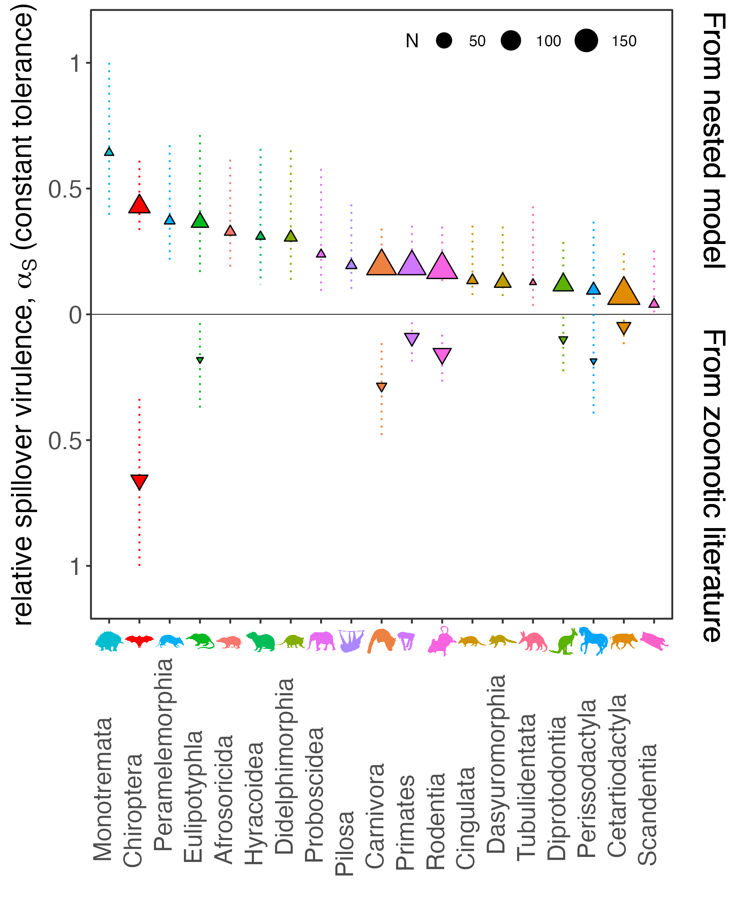

We see that are predictions are fairly accurate in terms of relative
rank - we over-predict the virulence of Primates and under-predict the
virulence of Carnivores.

We can also plot these predictions from complete tolerance assumptions,
here replicating Fig. S4 of the Supplementary Information Appendix:

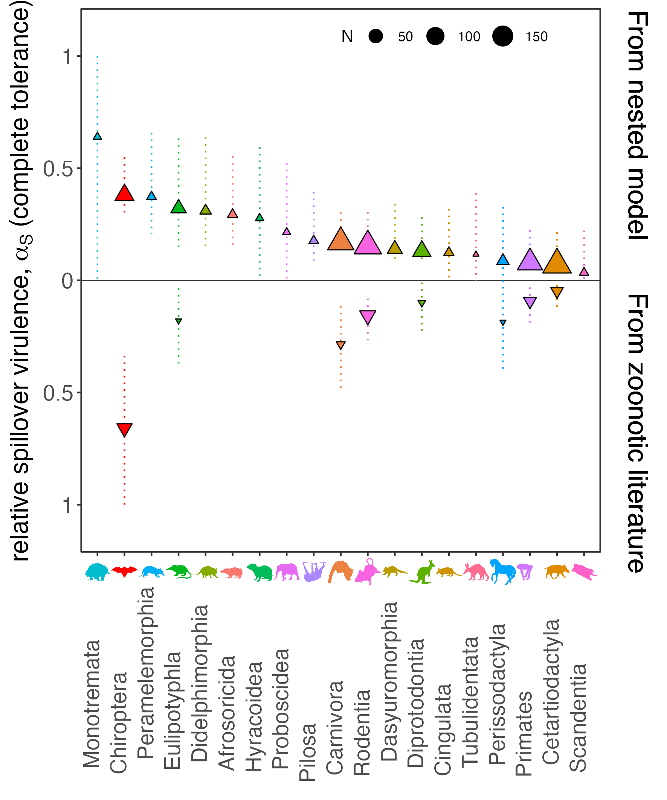

However, when we plot against a different dataset with rabies excluded
from the Guth et al. 2022 dataset, we find that our predictions align
even better, here across the whole dataset (note that this is Fig. S5A
of the Supplementary Information Appendix):

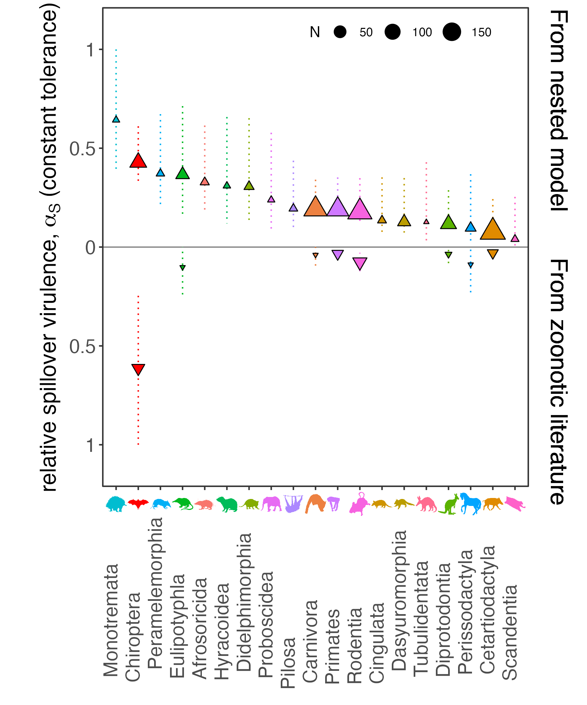

And here under complete tolerance assumptions with rabies excluded as
well (Fig. S5B of the Supplementary Information Appendix):

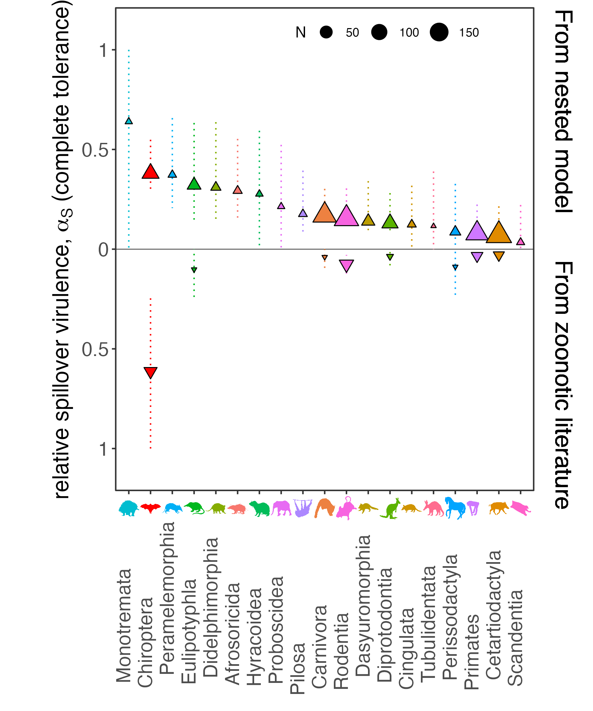
